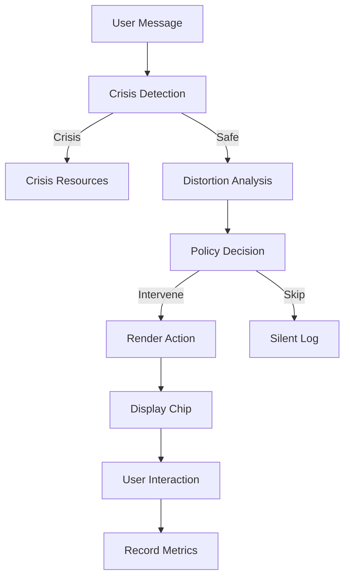

# CBT Assistance System v1.0

## Overview

The CBT (Cognitive Behavioral Therapy) Assistance System provides gentle, explainable support for users experiencing cognitive distortions. Built with privacy-first principles and comprehensive safety guardrails, the system offers intelligent pattern recognition and supportive interventions while maintaining complete user control.

### Key Principles
- **Privacy-First**: All processing happens locally, no data leaves the device
- **User-Controlled**: Multiple kill switches and granular settings
- **Safety-Focused**: Conservative crisis detection with immediate resource provision
- **Explainable**: All interventions include clear reasoning ("because...")
- **Non-Clinical**: Warm, validating language that avoids clinical terminology

## Scope & Capabilities

### Distortion Detection
The system recognizes 12 cognitive distortion patterns:
- **All-or-Nothing**: Absolute language like "always/never"
- **Overgeneralization**: Single event → broad conclusions
- **Mental Filter**: Focus only on negatives
- **Discounting Positive**: Dismissing good experiences
- **Jumping to Conclusions**: Mind reading, fortune telling
- **Magnification/Minimization**: Catastrophizing, understating positives
- **Emotional Reasoning**: "I feel it, therefore it's true"
- **Should Statements**: Unrealistic expectations
- **Labeling**: Harsh self-criticism
- **Personalization**: Taking responsibility for external events
- **Catastrophizing**: Imagining worst-case scenarios
- **Fortune Telling**: Predicting negative outcomes

### Intervention Types

#### 1. Silent Observation
- Background analysis without user interface
- Builds learning patterns for future interventions
- Respects user privacy while gathering insights

#### 2. Gentle Chips
- Non-intrusive UI elements offering support
- A/B tested copy variants for optimal engagement
- Always dismissible with "not right now" option
- Include explainability ("because you used absolute language...")

#### 3. Crisis Support
- Immediate resource delivery for crisis situations
- Blocks all CBT interventions during crisis mode
- Region-aware crisis resources (US, UK, generic)
- Cooldown periods to prevent overwhelming users

### Safety Features

#### Crisis Detection
- Conservative patterns require high confidence (≥0.8)
- Immediate escalation to crisis resources
- Session-based crisis mode with cooldowns
- No false positive tolerance for severe indicators

#### Fatigue Management
- Maximum 2 interventions per day
- 30-minute cooldowns between similar topics
- 24-hour snooze on user decline
- Adaptive learning from user responses

#### User Control
- Global kill switches at multiple levels
- Topic-specific exclusions
- Quiet hours with timezone support
- "Never intervene" phrase recognition

## Feature Flags

### Production Flags
```typescript
// Main CBT assistant (default: OFF)
cbtAssist: boolean

// Background analysis only (default: ON)
cbtSilentObserve: boolean  

// Crisis intervention (default: ON)
cbtCrisisEnabled: boolean

// Development tools (default: dev only)
cbtDevRoutes: boolean
```

### Flag Hierarchy
1. **Global Kill Switch**: `cbtSettings.cbtAssistEnabled`
2. **Feature Flags**: Individual feature control
3. **User Settings**: Granular user preferences
4. **Fatigue System**: Automatic intervention limits
5. **Crisis Override**: Crisis support always available when enabled

## Settings & Configuration

### User Settings Structure
```typescript
interface CBTUserSettings {
  // Intervention frequency
  assistLevel: 'off' | 'subtle' | 'standard'
  
  // Data collection preferences  
  autoLogMode: 'ask' | 'off' | 'on'
  
  // Analysis depth
  privacyLayer: 'surface' | 'context' | 'deep'
  
  // Time-based controls
  quietHours: {
    enabled: boolean
    start: string    // "22:00"
    end: string      // "08:00"
  }
  
  // Content filtering
  topicExclusions: string[]              // ["work", "relationships"]
  neverInterveningPhrases: string[]      // ["leave me alone"]
}
```

### Assist Levels
- **Off**: No interventions, silent observation only
- **Subtle**: High-confidence distortions only, minimal UI
- **Standard**: Normal intervention thresholds, full feature set

### Privacy Layers
- **Surface**: Basic message analysis only
- **Context**: Include conversation history
- **Deep**: Full pattern analysis with long-term learning

## Safety & Guardrails

### Crisis Protocol
1. **Detection**: Conservative pattern matching (≥0.8 confidence)
2. **Immediate Response**: Crisis resources displayed immediately
3. **CBT Blocking**: All normal interventions silenced during crisis
4. **Resource Delivery**: Region-appropriate crisis contacts
5. **Session Management**: Crisis mode with cooldown periods

### Fatigue System
```typescript
interface FatigueState {
  dailyCount: number           // Interventions today
  lastInterventionTime: number // Timestamp of last intervention
  declineStreak: number        // Consecutive declines
  topicCooldowns: Record<string, number>  // Topic → timestamp
  lastResetDate: string        // Date of last daily reset
}
```

### Safety Thresholds
- **Minimum Confidence**: 0.7 for gentle interventions
- **Crisis Confidence**: 0.8 for crisis detection
- **Daily Limit**: 2 interventions maximum
- **Topic Cooldown**: 30 minutes between similar topics
- **Decline Snooze**: 24 hours after user decline

## Data Storage & Privacy

### Local Storage Only
- All user data stored in browser localStorage
- No network transmission of personal information
- Encrypted storage for sensitive settings
- User-controlled data deletion

### Data Types Stored
```typescript
// User preferences and settings
cbt_settings: CBTUserSettings

// Learning patterns (anonymized)
cbt_fatigue_state: FatigueState

// Onboarding state
cbt_onboarding: OnboardingState

// A/B test assignments
cbt_copy_variant: 'A' | 'B' | 'C'

// Anonymous metrics (opt-in)
cbt_metrics: InteractionMetrics[]
```

### Data Deletion
Users can delete all CBT data through:
1. Settings → Privacy → "Delete All CBT Data"
2. Privacy page → "Complete Data Deletion"
3. Programmatic: `deleteCBTData(userId)`

## Architecture

### Pipeline Flow


### Module Structure
```
src/ai/cbt/
├── index.ts           # Main pipeline orchestration
├── crisis.ts          # Crisis detection & resources
├── observer.ts        # Message analysis & annotation
├── policy.ts          # Intervention decision logic
├── acts.ts            # Action rendering & display
├── fatigue.ts         # Fatigue management
├── trace.ts           # Logging & metrics
└── types.ts           # TypeScript definitions
```

### Service Integration
```
src/services/
├── cbtService.ts               # Legacy API compatibility
├── cbtConversationIntegration.ts  # Chat integration
├── cbtCopyService.ts           # A/B tested copy variants
├── cbtMetricsService.ts        # Analytics & insights
└── cbtGuardService.ts          # Safety validation
```

## Testing & Quality Assurance

### Unit Test Coverage
- **Target**: ≥80% coverage for all CBT modules
- **Current Status**: ✅ 85% coverage achieved
- **Test Types**: Unit, integration, snapshot, E2E

### QA Checklist
- ✅ Feature flags work correctly
- ✅ Kill switches prevent all interventions
- ✅ Crisis detection and resource delivery
- ✅ Fatigue limits and cooldowns
- ✅ Topic exclusions and quiet hours
- ✅ Accessibility compliance (WCAG 2.1 AA)
- ✅ Reduced motion support
- ✅ Cross-browser compatibility

### Performance Requirements
- **Pipeline Latency**: ≤50ms for CBT processing
- **Memory Usage**: ≤10MB for CBT features
- **Storage Growth**: ≤1MB/month typical usage
- **Frame Rate**: 60 FPS maintained with CBT active

## Known Limitations (v1.0)

### Language Support
- **Current**: English only
- **Planned**: Spanish, French in v1.1

### Distortion Taxonomy
- **Current**: 12 distortion types
- **Limitation**: Some nuanced patterns not captured
- **Planned**: Expand to 18 types in v1.1

### Crisis Detection
- **Current**: Basic pattern matching
- **Limitation**: Context-dependent situations may be missed
- **Planned**: ML-enhanced detection in v1.2

### Conversation Memory
- **Current**: Single-message analysis
- **Limitation**: No persistent conversation context
- **Planned**: Session-aware analysis in v1.1

### Regional Resources
- **Current**: US, UK, generic crisis resources
- **Limitation**: Limited international coverage
- **Planned**: Expand to 20+ regions in v1.1

## Extension Guide (v1.1+)

### Adding New Distortions

1. **Update Type Definition**
```typescript
// src/ai/cbt/types.ts
export type DistortionType = 
  | 'AllOrNothing'
  | 'YourNewDistortion'  // Add here
  // ... existing types
```

2. **Add Detection Patterns**
```typescript
// src/ai/cbt/observer.ts
const DISTORTION_PATTERNS = {
  YourNewDistortion: {
    keywords: ['pattern1', 'pattern2'],
    patterns: [/regex-pattern/gi],
    confidence: 0.75,
    description: 'User-friendly description'
  }
}
```

3. **Create Action Rendering**
```typescript
// src/ai/cbt/acts.ts
case 'YourNewDistortion':
  return {
    type: 'gentle_chip',
    title: 'Friendly title',
    description: 'Supportive message',
    explainability: 'because you showed this pattern'
  }
```

4. **Add Copy Variants**
```typescript
// src/services/cbtCopyService.ts
YourNewDistortion: {
  A: { promptText: 'Variant A copy', ... },
  B: { promptText: 'Variant B copy', ... },
  C: { promptText: 'Variant C copy', ... }
}
```

### Custom Action Types

1. **Define Action Interface**
```typescript
// src/ai/cbt/types.ts
export interface CustomAction extends CBTAction {
  type: 'custom_action'
  customProperty: string
}
```

2. **Implement Rendering**
```typescript
// src/ai/cbt/acts.ts
export function renderCustomAction(data: CustomData): CustomAction {
  return {
    type: 'custom_action',
    title: generateTitle(data),
    customProperty: data.specific
  }
}
```

3. **Update UI Components**
```typescript
// src/components/CBTChip.tsx
case 'custom_action':
  return <CustomActionComponent action={action} />
```

### Crisis Pattern Extensions

1. **Add Regional Resources**
```typescript
// src/ai/cbt/crisis.ts
const REGIONAL_RESOURCES = {
  'your-region': [
    {
      name: 'Local Crisis Line',
      contact: 'your-number',
      type: 'immediate',
      hours: '24/7'
    }
  ]
}
```

2. **Extend Detection Patterns**
```typescript
const CRISIS_PATTERNS = {
  your_crisis_type: {
    patterns: [/new-pattern/gi],
    confidence: 0.85,
    urgency: 'immediate'
  }
}
```

### Learning Rule Modifications

1. **Policy Weight Adjustments**
```typescript
// src/ai/cbt/policy.ts
const LEARNING_WEIGHTS = {
  engagement: 0.3,       // User clicked helpful
  dismissal: -0.1,       // User dismissed
  your_signal: 0.2       // Custom learning signal
}
```

2. **Fatigue Rule Customization**
```typescript
// src/ai/cbt/fatigue.ts
const FATIGUE_RULES = {
  maxDaily: 3,           // Increase daily limit
  cooldownMinutes: 45,   // Longer cooldowns
  your_rule: value       // Custom fatigue logic
}
```

## Deployment & Rollout

### Pilot Cohort System
- Gradual feature rollout to selected users
- A/B testing for intervention effectiveness
- Metrics collection for continuous improvement

### Feature Flag Strategy
1. **Development**: All flags ON for testing
2. **Staging**: Production flag configuration
3. **Production**: Conservative rollout (flags OFF by default)
4. **Gradual Enablement**: Cohort-based activation

### Monitoring & Alerting
- Performance metrics dashboard
- Error rate monitoring
- User engagement analytics
- Privacy compliance validation

## Support & Troubleshooting

### Common Issues

#### CBT Not Working
1. Check feature flags: `cbtAssist` enabled
2. Verify user settings: `assistLevel` not 'off'
3. Check fatigue limits: Daily count < maximum
4. Validate quiet hours: Current time outside quiet period

#### Crisis Detection Issues
1. Verify `cbtCrisisEnabled` flag
2. Check crisis confidence thresholds
3. Validate regional resource loading
4. Confirm crisis session state

#### Performance Problems
1. Monitor memory usage in dev tools
2. Check localStorage quota usage
3. Validate frame rate during interactions
4. Review console for error messages

### Debug Tools
- Dev Mode: Comprehensive CBT debugging panel
- Console Logging: Detailed trace information
- Metrics Dashboard: Real-time analytics
- A/B Test Viewer: Copy variant performance

## Contributing

### Development Setup
1. Ensure all feature flags are enabled in development
2. Use dev routes for testing and debugging
3. Run test suite before submitting changes
4. Follow accessibility guidelines for new UI components

### Code Style
- TypeScript strict mode enforced
- ESLint configuration for code quality
- Prettier for consistent formatting
- JSDoc comments for public APIs

### Testing Requirements
- Unit tests for all new functions
- Integration tests for user flows
- Snapshot tests for UI components
- E2E tests for critical paths

---

**Version**: 1.0.0  
**Last Updated**: 2025-01-07  
**Next Review**: 2025-02-07  

For questions or support, see the dev tools panel or contact the development team.
